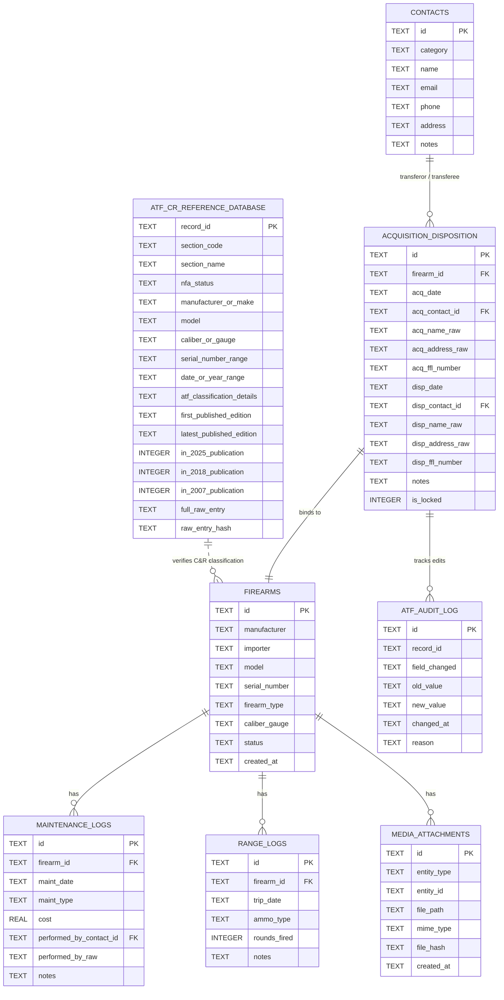
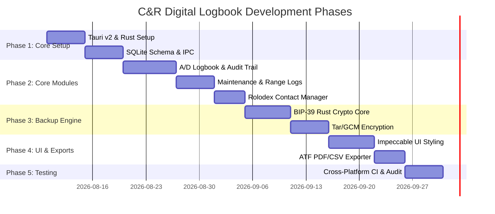

# Software Architecture & Engineering Plan: C&R Collector Digital Logbook

**Target Audience:** Lead Software Engineer / Full-Stack Desktop Engineer  
**Target User:** Type 03 (Collector of Curios and Relics) ATF Licensees  
**Platform Target:** Cross-Platform Offline Portable Desktop Application (Windows, macOS, Linux)  
**Tech Stack:** Tauri v2 + Rust Core + React / TypeScript + SQLite  

---

## 1. Executive Summary & Product Overview

The **C&R Digital Logbook** is an offline-first, highly secure, portable desktop application custom-engineered for Federal Firearms License (FFL) **Type 03 Collectors of Curios and Relics**. 

Pursuant to **27 CFR § 478.125(f)** and **ATF Ruling 2016-1 / 2021R-05F**, collectors must maintain an accurate record of firearm acquisitions and dispositions. This application provides a compliant Bound Book combined with maintenance tracking, range logs, contact management, and media attachments.

### Core Architecture Highlights
* **Zero Network Dependency:** 100% local execution and storage for privacy and portability. Runs from local drives or portable USB storage.
* **Tauri v2 Infrastructure:** Lightweight native OS Webview host powered by a memory-safe Rust backend (~15MB binary footprint vs ~80MB+ Electron).
* **BIP-39 Encrypted Portable Backups:** Industry-standard 12-word seed phrase encryption (AES-256-GCM + Argon2id / PBKDF2 key derivation) for backup archives.
* **ATF Bound Book Audit Integrity:** Immutable audit logs, auto-incrementing line tracking, versioned corrections, and 1-click compliant PDF/CSV export for inspections.
* **Development & Release Standards:** Strict adherence to [Conventional Commits v1.0.0](https://www.conventionalcommits.org/en/v1.0.0/) (`feat:`, `fix:`, `docs:`, `refactor:`, `test:`, `chore:`) and [Semantic Versioning 2.0.0](https://semver.org/) (`MAJOR.MINOR.PATCH`).

---

## 2. System Architecture & Tech Stack

```
+-----------------------------------------------------------------------+
|                           FRONTEND LAYER                              |
|   React 18 + TypeScript + TailwindCSS / Custom Design System           |
|   Lucide Icons + TanStack Table + Recharts + Zustand State Management |
+-----------------------------------------------------------------------+
                                   |
                         Tauri v2 IPC (JSON RPC)
                                   |
+-----------------------------------------------------------------------+
|                         RUST CORE BACKEND                             |
|  - App State & Command Handlers    - Backup Engine (bip39/aes-gcm)    |
|  - SQLite Connection Pool (rusqlite)- File Storage Manager            |
|  - ATF Audit Engine                - System Native Dialogs            |
+-----------------------------------------------------------------------+
                                   |
                   +---------------+---------------+
                   |                               |
        +--------------------+           +-------------------+
        | SQLite DB File     |           | Encrypted Backup  |
        | (WAL Mode)         |           | (.crbk Archive)   |
        +--------------------+           +-------------------+
```

### Stack Breakdown

| Layer | Technology | Purpose |
| :--- | :--- | :--- |
| **GUI Framework** | Tauri v2 | Cross-platform desktop shell utilizing system WebView2 (Win), WebKit (macOS/Linux). |
| **Frontend UI** | React 18, TypeScript, Vite | Modern, dynamic reactive interface with strict type safety. |
| **State & Tables** | Zustand, TanStack Table v8 | Client-side reactive state management and high-performance data tables with sorting/filtering. |
| **Styling** | Vanilla CSS / Tailwind + Impeccable Design Token Palette | Custom dark slate / gunmetal aesthetic, fluid layout, high contrast. |
| **Backend Language** | Rust (v1.75+) | Native performance, memory safety, system IPC handlers, file I/O, and crypto. |
| **Database Engine** | SQLite (via `rusqlite` / `sqlx`) | Embedded relational DB with Write-Ahead Logging (WAL) enabled for durability. |
| **Crypto Library** | `bip39`, `argon2`, `aes-gcm`, `tar`, `flate2` | Rust crates for seed phrase key derivation, AES-256-GCM encryption, and archive compression. |

---

## 3. Database Schema & Data Models

The relational database uses SQLite. Foreign key constraints are enforced (`PRAGMA foreign_keys = ON;`).



### SQL DDL Specification (`schema.sql`)

```sql
PRAGMA foreign_keys = ON;

-- 1. Contacts (Rolodex)
CREATE TABLE IF NOT EXISTS contacts (
    id TEXT PRIMARY KEY, -- UUID v4
    category TEXT NOT NULL CHECK(category IN ('Dealer', 'Manufacturer', 'Gunsmith', 'Other')),
    name TEXT NOT NULL,
    email TEXT,
    phone TEXT,
    address TEXT,
    notes TEXT,
    created_at TEXT NOT NULL DEFAULT (datetime('now')),
    updated_at TEXT NOT NULL DEFAULT (datetime('now'))
);

-- 2. Core Firearms Catalog
CREATE TABLE IF NOT EXISTS firearms (
    id TEXT PRIMARY KEY, -- UUID v4
    manufacturer TEXT NOT NULL,
    importer TEXT, -- Required if imported (27 CFR 478.125)
    model TEXT NOT NULL,
    serial_number TEXT NOT NULL,
    firearm_type TEXT NOT NULL CHECK(firearm_type IN ('Rifle', 'Pistol', 'Revolver', 'Shotgun', 'Receiver', 'Other')),
    caliber_gauge TEXT NOT NULL,
    status TEXT NOT NULL DEFAULT 'Acquired' CHECK(status IN ('Acquired', 'Disposed')),
    created_at TEXT NOT NULL DEFAULT (datetime('now'))
);

-- 3. ATF Acquisition & Disposition Bound Book
CREATE TABLE IF NOT EXISTS acquisition_disposition (
    id TEXT PRIMARY KEY, -- UUID v4
    firearm_id TEXT NOT NULL UNIQUE,
    
    -- Acquisition Data
    acq_date TEXT NOT NULL, -- ISO-8601 YYYY-MM-DD
    acq_contact_id TEXT,
    acq_name_raw TEXT NOT NULL,
    acq_address_raw TEXT,
    acq_ffl_number TEXT,
    
    -- Disposition Data (NULL until disposed)
    disp_date TEXT, -- ISO-8601 YYYY-MM-DD
    disp_contact_id TEXT,
    disp_name_raw TEXT,
    disp_address_raw TEXT,
    disp_ffl_number TEXT,
    
    notes TEXT,
    is_locked INTEGER NOT NULL DEFAULT 0, -- 1 if entry is locked against non-audit edits
    
    FOREIGN KEY (firearm_id) REFERENCES firearms(id) ON DELETE CASCADE,
    FOREIGN KEY (acq_contact_id) REFERENCES contacts(id) ON DELETE SET NULL,
    FOREIGN KEY (disp_contact_id) REFERENCES contacts(id) ON DELETE SET NULL
);

-- 4. Maintenance Log
CREATE TABLE IF NOT EXISTS maintenance_logs (
    id TEXT PRIMARY KEY, -- UUID v4
    firearm_id TEXT NOT NULL,
    maint_date TEXT NOT NULL, -- ISO-8601 YYYY-MM-DD
    maint_type TEXT NOT NULL, -- e.g., Cleaning, Repair, Part Replacement, Refinishing
    cost REAL NOT NULL DEFAULT 0.0,
    performed_by_contact_id TEXT,
    performed_by_raw TEXT NOT NULL,
    notes TEXT,
    created_at TEXT NOT NULL DEFAULT (datetime('now')),
    
    FOREIGN KEY (firearm_id) REFERENCES firearms(id) ON DELETE CASCADE,
    FOREIGN KEY (performed_by_contact_id) REFERENCES contacts(id) ON DELETE SET NULL
);

-- 5. Range Log
CREATE TABLE IF NOT EXISTS range_logs (
    id TEXT PRIMARY KEY, -- UUID v4
    firearm_id TEXT NOT NULL,
    trip_date TEXT NOT NULL, -- ISO-8601 YYYY-MM-DD
    ammo_type TEXT NOT NULL, -- Brand, grain, caliber (e.g. Winchester 7.62x54R 180gr FMJ)
    rounds_fired INTEGER NOT NULL CHECK(rounds_fired > 0),
    notes TEXT,
    created_at TEXT NOT NULL DEFAULT (datetime('now')),
    
    FOREIGN KEY (firearm_id) REFERENCES firearms(id) ON DELETE CASCADE
);

-- 6. Media Attachments (Photos, Invoices, Receipts)
CREATE TABLE IF NOT EXISTS media_attachments (
    id TEXT PRIMARY KEY, -- UUID v4
    entity_type TEXT NOT NULL CHECK(entity_type IN ('firearm', 'maintenance', 'range', 'contact')),
    entity_id TEXT NOT NULL,
    file_path TEXT NOT NULL, -- Relative path inside app data folder
    mime_type TEXT NOT NULL,
    file_hash TEXT NOT NULL, -- SHA-256 for duplicate checking
    created_at TEXT NOT NULL DEFAULT (datetime('now'))
);

-- 7. ATF Immutable Audit Log (ATF Ruling 2016-1 / 2021R-05F Compliance)
CREATE TABLE IF NOT EXISTS atf_audit_log (
    id TEXT PRIMARY KEY, -- UUID v4
    record_id TEXT NOT NULL,
    table_name TEXT NOT NULL,
    field_changed TEXT NOT NULL,
    old_value TEXT,
    new_value TEXT,
    changed_at TEXT NOT NULL DEFAULT (datetime('now')),
    reason TEXT NOT NULL
);

-- 8. ATF Master C&R Reference Database (Searchable Reference Library)
CREATE TABLE IF NOT EXISTS atf_cr_reference_database (
    record_id TEXT PRIMARY KEY, -- e.g. CR-SEC2-0001
    section_code TEXT NOT NULL, -- e.g. Section II
    section_name TEXT NOT NULL,
    nfa_status TEXT NOT NULL,
    manufacturer_or_make TEXT NOT NULL,
    model TEXT,
    caliber_or_gauge TEXT,
    serial_number_range TEXT,
    date_or_year_range TEXT,
    atf_classification_details TEXT NOT NULL,
    first_published_edition TEXT NOT NULL,
    latest_published_edition TEXT NOT NULL,
    in_2025_publication INTEGER NOT NULL DEFAULT 1,
    in_2018_publication INTEGER NOT NULL DEFAULT 0,
    in_2007_publication INTEGER NOT NULL DEFAULT 0,
    full_raw_entry TEXT NOT NULL,
    raw_entry_hash TEXT NOT NULL UNIQUE,
    updated_at TEXT NOT NULL DEFAULT (datetime('now'))
);

-- Indexes for Fast Search & Autocomplete
CREATE INDEX IF NOT EXISTS idx_firearms_serial ON firearms(serial_number);
CREATE INDEX IF NOT EXISTS idx_ad_acq_date ON acquisition_disposition(acq_date);
CREATE INDEX IF NOT EXISTS idx_maint_firearm ON maintenance_logs(firearm_id);
CREATE INDEX IF NOT EXISTS idx_range_firearm ON range_logs(firearm_id);
CREATE INDEX IF NOT EXISTS idx_ref_mfr ON atf_cr_reference_database(manufacturer_or_make);
CREATE INDEX IF NOT EXISTS idx_ref_model ON atf_cr_reference_database(model);
CREATE INDEX IF NOT EXISTS idx_ref_sec ON atf_cr_reference_database(section_code);
```

---

## 4. Key Functional Modules & Requirements

### Module 1: ATF Type 03 Acquisition / Disposition Logbook
* **Regulatory Compliance Rules (27 CFR § 478.125(f)):**
  1. Entry of acquisition must be recorded within 7 days of receipt.
  2. Entry of disposition must be recorded within 7 days of transfer.
  3. Bound Book columns required:
     - Date of Receipt
     - Name and Address (or Name and FFL Number) of Seller/Transferor
     - Manufacturer & Importer (if imported)
     - Model, Serial Number, Type, Caliber/Gauge
     - Date of Disposition
     - Name and Address (or Name and FFL Number) of Buyer/Transferee
* **Audit Trail & Immutable Records:**
  - Corrections do not overwrite existing DB records directly without writing a record to `atf_audit_log`.
  - Every change requires a user prompt: *"Reason for Correction (e.g. Typo in Serial Number)"*.
  - Lock feature: Once a record is marked verified, it cannot be modified without audit logging.
* **1-Click Inspection Export:**
  - Export to standardized ATF PDF / Printable HTML format matching official ATF 478.125 Bound Book table layout.
  - Export to CSV format for digital backup audit.

### Module 2: Maintenance Tracker
* Tracks routine cleaning, gunsmith repairs, barrel replacements, and restorations.
* Direct link to A/D Logbook Firearm record via dropdown autocomplete.
* Cost summary analytics per firearm and total collection maintenance expense.
* Supports attaching receipts/invoices as PDF or image files.

### Module 3: Range Trip Logbook
* Track range outings, ammo performance, and cumulative round counts.
* Automatic round counter tally per firearm (updates lifetime round count display on firearm dashboard).
* Tracks ammunition types (e.g., surplus corrosive vs modern commercial) to alert user to post-range cleaning requirements.

### Module 4: Contacts & FFL Rolodex
* Category tags: **Dealer**, **Manufacturer**, **Gunsmith**, **Other**.
* Auto-populates transferor/transferee fields in the A/D log when selected.
* Stores license numbers (FFL # format verification `X-XX-XXX-XX-XX-XXXXX`), expiration dates, phone numbers, address, and notes.

### Module 5: Media & Document Store
* Store high-resolution photos of firearm proof marks, receiver serial numbers, and C&R provenance documentation.
* Automatic compression and thumbnail generation (WebP / JPEG).
* Files stored locally in relative directory structure `<AppDir>/media/<entity_id>/<file_hash>.webp`.

### Module 6: ATF C&R Master Reference Database & CSV Importer Engine
* **Pre-bundled Master Reference Library:**
  - The application ships pre-seeded with `curios_and_relics_master_list.csv` (4,207 records extracted across ATF publications from 1972 through April 2025).
  - Pre-populated on initial app startup into `atf_cr_reference_database` table so collectors have immediate offline access to the complete ATF C&R database.
* **CSV Import, Deduplication & Amendment Engine:**
  - Allows users to import updated CSV releases as new ATF publications are issued.
  - **Deduplication Strategy:** Primary matching on `record_id` and normalized `raw_entry_hash` (SHA-256 of lowercase alphanumeric text).
  - **Amending Logic:**
    ```sql
    INSERT INTO atf_cr_reference_database (
        record_id, section_code, section_name, nfa_status, manufacturer_or_make,
        model, caliber_or_gauge, serial_number_range, date_or_year_range,
        atf_classification_details, first_published_edition, latest_published_edition,
        in_2025_publication, in_2018_publication, in_2007_publication, full_raw_entry, raw_entry_hash
    ) VALUES (?, ?, ?, ?, ?, ?, ?, ?, ?, ?, ?, ?, ?, ?, ?, ?, ?)
    ON CONFLICT(raw_entry_hash) DO UPDATE SET
        latest_published_edition = excluded.latest_published_edition,
        atf_classification_details = excluded.atf_classification_details,
        serial_number_range = COALESCE(excluded.serial_number_range, atf_cr_reference_database.serial_number_range),
        updated_at = datetime('now');
    ```
* **Interactive C&R Search & Logbook Auto-Lookup:**
  - Dedicated **ATF C&R Reference Library** view with fast multi-field search (Filter by Manufacturer, Model, Caliber, Section Code, or NFA Status).
  - **A/D Entry Integration:** When logging a firearm acquisition, typing in the Manufacturer/Model triggers live autocomplete against `atf_cr_reference_database`.
  - Selecting a match auto-populates firearm specifications and attaches a visual **"Official ATF C&R Listed"** badge with section citation (`Section II / III / IIIA / IV`) directly to the bound book record.

---

## 5. BIP-39 Encrypted Backup & Restore Specification

To guarantee user privacy and data ownership, backups are standalone `.crbk` (Curio & Relic Backup) files that can be stored anywhere (USB drive, external HDD, offline vault).

### Encryption Pipeline Architecture

```
                      +-----------------------------+
                      | 12-Word BIP-39 Seed Mnemonic |
                      +-----------------------------+
                                     |
                         argon2id / PBKDF2 Key Derivation
                                     |
                                     v
                          256-bit Encryption Key
                                     |
  +--------------------+             v             +--------------------+
  | SQLite DB File     | ---> [ AES-256-GCM ] <--- | Media Store Directory
  +--------------------+      Payload Wrapper      +--------------------+
                                     |
                                     v
                        Compressed Payload (.tar.gz)
                                     |
                                     v
                         Target `.crbk` Backup File
```

### Step-by-Step Backup Algorithm (Rust Core Engine)

1. **Entropy & Mnemonic Generation:**
   - Use `bip39::Mnemonic::generate(12)` to create a random 128-bit entropy seed phrase (12 words from standard English wordlist).
   - Display 12-word seed phrase to user on screen inside a secure modal with print/save warning.
2. **Key Derivation (KDF):**
   - Derive a 32-byte (256-bit) master symmetric key from the mnemonic using `Argon2id` (or `PBKDF2-HMAC-SHA256` with 600,000 iterations) with a 16-byte random salt.
3. **Archive Assembly:**
   - Create an in-memory or temp `.tar.gz` archive containing:
     - `database.sqlite` (Clean SQLite dump / snapshot after `PRAGMA wal_checkpoint(FULL);`)
     - `media/` directory (All stored photos/documents)
     - `manifest.json` (App version, schema version, creation timestamp, salt, IV/nonce).
4. **AEAD Encryption:**
   - Encrypt the `.tar.gz` archive using **AES-256-GCM**.
   - Prepend file magic header `CRBKv1`, salt (16 bytes), and GCM Nonce (12 bytes) to the encrypted payload.
5. **Output File:**
   - Save to path chosen by user via OS native save dialog (`/media/usb/cnr_logbook_backup_2026-08-06.crbk`).

### Restore Process
1. User selects `.crbk` file location.
2. App prompts user for 12-word mnemonic string.
3. Rust backend validates mnemonic against BIP-39 checksum.
4. Derives 256-bit key using salt from file header.
5. Decrypts payload with AES-256-GCM. If authentication tag verification fails, error *"Invalid Seed Phrase or Corrupted Backup File"* is returned.
6. Unpacks tarball to target application directory and executes SQLite schema migration check.

---

## 6. UI/UX Design System (Guided by `impeccable.style`)

### Aesthetic Guidelines
* **Theme:** Deep charcoal / slate dark mode (#090D16 background, #1E293B surface containers, #38BDF8 cyan primary accent, #F59E0B amber secondary accent).
* **Typography:** Inter / System Sans-serif, high legibility monospaced font for Serial Numbers and FFL numbers (`JetBrains Mono` or `Roboto Mono`).
* **Density:** High-density desktop layout optimized for keyboard-driven data entry and deep table scannability.
* **Component Kit:** Custom Tailwind/CSS components styled with smooth 150ms micro-transitions, subtle borders (`border-slate-800`), glassmorphic popovers, and crisp badge pills.

### Key Layout Views

1. **Dashboard Overview:**
   - Stats summary: Total C&R Firearms in Collection, Active Acquisitions, Dispositions, Total Range Rounds Fired, YTD Maintenance Expense.
   - Quick Action buttons: `+ Record Acquisition`, `+ Log Range Trip`, `+ Add Maintenance`, `+ Backup Now`.
   - Recent activity list & fast search bar (keyboard shortcut `Ctrl+K` / `Cmd+K`).
2. **A/D Bound Book View:**
   - TanStack grid with split pane view (Left: Searchable table; Right: Selected firearm details, photos, & complete history timeline).
   - Columns: Status, Acq Date, Manufacturer, Model, Serial #, Type, Caliber, Seller, Disp Date, Buyer.
   - Filter chips: `Active Collection`, `Disposed`, `Rifles`, `Pistols`, `Revolvers`, `Shotguns`.
3. **Firearm Detail Page:**
   - Tabs: `Overview & Spec Sheet`, `Acquisition/Disposition Info`, `Maintenance History`, `Range Logs`, `Photo Gallery`, `Audit History`.
4. **Backup & Security Portal:**
   - Simple visual cards showing last backup date, backup status indicator, and clear action triggers for `Create BIP-39 Backup` and `Restore from Backup`.
5. **ATF C&R Master Reference Library & CSV Import Portal:**
   - Searchable directory of all 4,207 pre-loaded C&R listings with section badges (`Section II`, `Section III`, `Section IIIA`, `Section IV`, `Section I`).
   - Search bar supporting fuzzy queries across Manufacturer, Model, Caliber, and Serial Number requirements.
   - **`Import C&R CSV Update` Button:** File picker supporting future publication CSVs with animated import progress, deduplication report, and entry amendment summary.

---

## 7. Security, Reliability & Portability Requirements

1. **Portable Desktop Packaging:**
   - Single standalone installer and zero-install portable folder mode for USB drives.
   - Cross-platform builds: Windows `.msi` / `.exe`, macOS `.dmg` / `.app` (Universal Apple Silicon & Intel), Linux `.AppImage` / `.deb`.
2. **Offline Data Isolation:**
   - No external API calls, tracking scripts, or analytics. Zero outbound telemetry.
   - App binds exclusively to local localhost IPC sockets.
3. **Data Integrity Guarantee:**
   - SQLite WAL mode enabled (`PRAGMA journal_mode=WAL;`).
   - `PRAGMA synchronous = NORMAL;` to prevent database corruption during sudden OS power loss.

---

## 8. Software Engineering Implementation Roadmap



### Phase 1: Project Setup & Database Engine (Week 1)
- Initialize Tauri v2 project structure with React, TypeScript, and Vite.
- Implement Rust `rusqlite` database manager with WAL mode, table creation migrations, and IPC handlers.

### Phase 2: Logbook & Auxiliary Modules (Weeks 2-3)
- Implement A/D Bound Book CRUD, validation logic, and ATF 2016-1 audit log triggers.
- Build Maintenance Log, Range Log, and Contacts Rolodex components.
- Connect local media attachment storage to filesystem.

### Phase 3: Cryptographic Backup Subsystem (Week 4)
- Implement Rust crate integration (`bip39`, `argon2`, `aes-gcm`).
- Build `.crbk` archive pack/unpack routines and test backup restoration round-trips.

### Phase 4: UI Refinement & ATF Export Engine (Week 5)
- Polish UI using `impeccable.style` design tokens, dark mode palette, and keyboard navigation.
- Implement HTML/PDF generation engine for ATF 478.125 compliant bound book printable reports.

### Phase 5: Cross-Platform Packaging & Quality Assurance (Week 6)
- Test multi-OS binary builds (Windows, macOS, Linux).
- Conduct power-loss resilience tests and database integrity verification.
